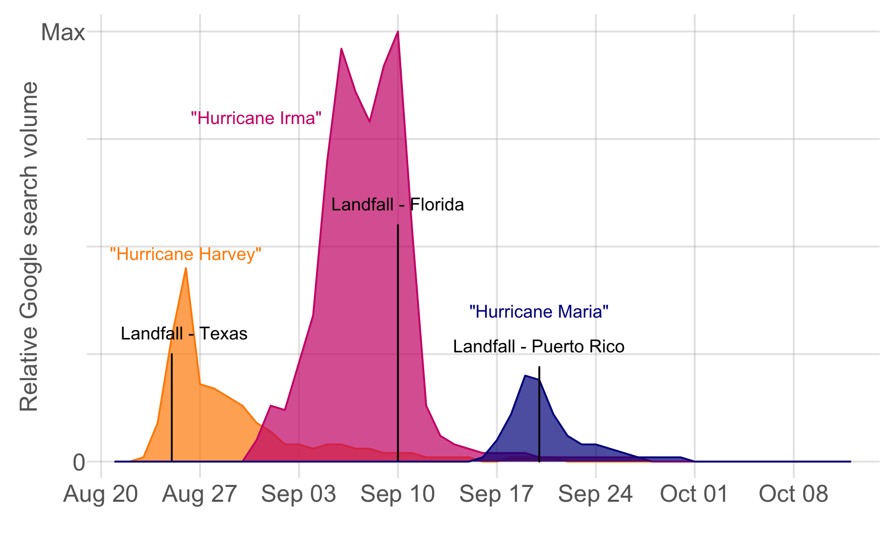

## Hurricane Media Coverage Updates - UPDATED Oct 16, 2017

On September 28, 2017, [Dhrumil Mehta](https://twitter.com/DataDhrumil) of [FiveThirtyEight.com](http://fivethirtyeight.com/) 
published ["The Media Really Has Neglected Puerto Rico"](https://fivethirtyeight.com/features/the-media-really-has-neglected-puerto-rico/),
an analysis of media coverage of the three major hurricanes hitting the US in August and September, 2017. On October 12, after initial updates were posted here, the FiveThirtyEight analysis was also updated: ["The Media Really Started Paying Attention To Puerto Rico When Trump Did"](https://fivethirtyeight.com/features/the-media-really-started-paying-attention-to-puerto-rico-when-trump-did/).

As of October 15, hurricane-specific coverage continues to dwindle with some more persistant coverage for Maria and Puerto Rico. In both online media and television, coverage of Texas (Harvey Harvey) and Florida (Hurricane Irma) appears to be reaching baseline rates while Puerto Rico is still appearing more often than normal, reflecting the monumental ongoing challenges being faced on the island (e.g. [the lack of electricity](Electricity.md)). Despite these challenges, the daily coverage of Maria in Puerto Rico has still never reached the peak intensity of coverage for Harvey or Irma in the states.  

### Online media coverage from [MediaCloud](https://mediacloud.org/)

### Television coverage from the [Internet Archive Television News Archive](https://television.gdeltproject.org/cgi-bin/iatv_ftxtsearch/iatv_ftxtsearch?)*

###### *Analysis by the GDELT Project using data from the Internet Archive Television News Archive.

### Searches on Google in the US (exc. Puerto Rico) from [Google Trends](https://trends.google.com/trends/)

