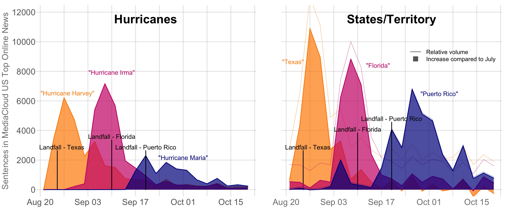
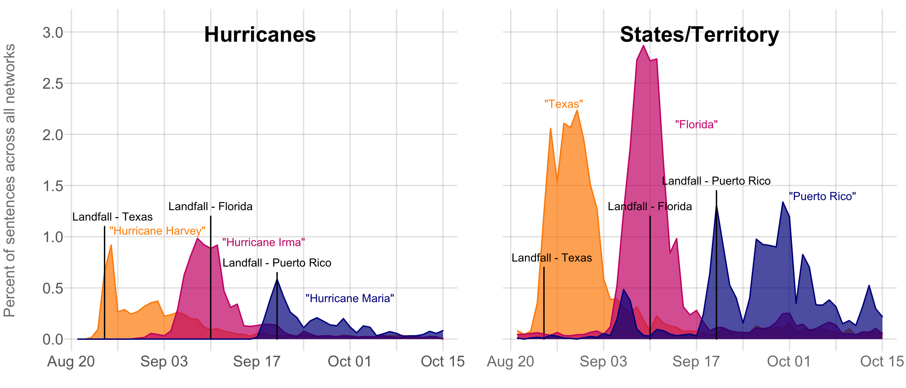
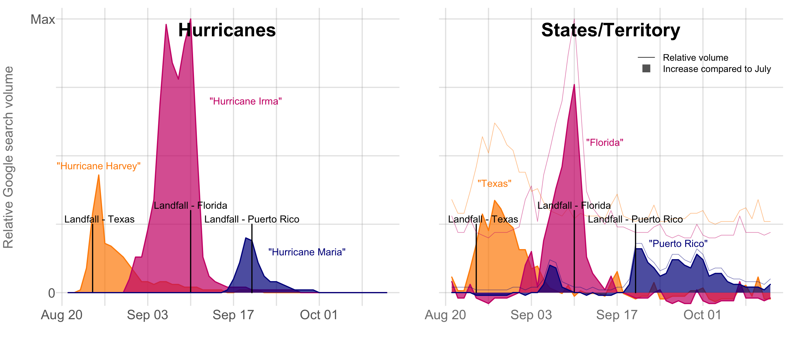

## Hurricane Media Coverage Updates

As of early November, despite some ongoing reporting and the continuing crises in Puerto Rico, media coverage of Puerto Rico and Hurricane Maria had essentially disappeared. Both online media (MediaCloud, below) and television (Television Explorer, below) show that coverage of Puerto Rico was barely above normal. Furthermore, Google search volume for Puerto Rico has also returned to baseline, indicating that even beyond the media there was very little interest in or awareness of what was happening on the island.

Early on after the hurricanes, there was more coverage of Maria in Puerto Rico, though not nearly as much as for Harvey in Texas or Irma in Florida. Generally media coverage of Texas and Florida tends to be higher than Puerto Rico, yet clear increases were evident up to roughly 2 weeks after landfall. For Puerto Rico, coverage never reached the peak intensity of the two states, but reporting was more sustained.

### Online media coverage from [MediaCloud](https://mediacloud.org/)

### Television coverage from the [Internet Archive Television News Archive](https://television.gdeltproject.org/cgi-bin/iatv_ftxtsearch/iatv_ftxtsearch?)*

###### *Analysis by the GDELT Project using data from the Internet Archive Television News Archive.

### Searches on Google in the US (exc. Puerto Rico) from [Google Trends](https://trends.google.com/trends/)

This analysis was originally implemented as a follow up on an analysis by [Dhrumil Mehta](https://twitter.com/DataDhrumil) of [FiveThirtyEight.com](http://fivethirtyeight.com/) 
published on September 28: ["The Media Really Has Neglected Puerto Rico"](https://fivethirtyeight.com/features/the-media-really-has-neglected-puerto-rico/). After initial updates were posted here, FiveThirtyEight published an updated analysis on October 12: ["The Media Really Started Paying Attention To Puerto Rico When Trump Did"](https://fivethirtyeight.com/features/the-media-really-started-paying-attention-to-puerto-rico-when-trump-did/).
