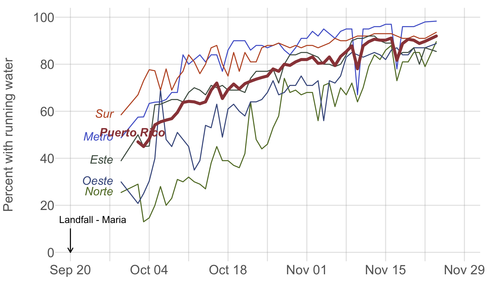

## Repository of data related to Hurricane Maria in Puerto Rico

On September 20, 2017, Hurricane Maria hit Puerto Rico as a Category 4 hurricane ([National Hurricane Center Maps](http://www.nhc.noaa.gov/archive/2017/MARIA_graphics.php)). Here are some data resources related to this storm and its aftermath.

### [StatusPR](StatusPR.md)
Analysis of progress in restoring water, communications, hospitals, and moving people from shelters.

### [Electricity](Electricity.md)
Analysis of progress on restoring electricity to all of Puerto Rico.

### [Media Coverage](MediaAnalysis.md)
Analysis of media coverage for Harvey, Irma, and Maria.

