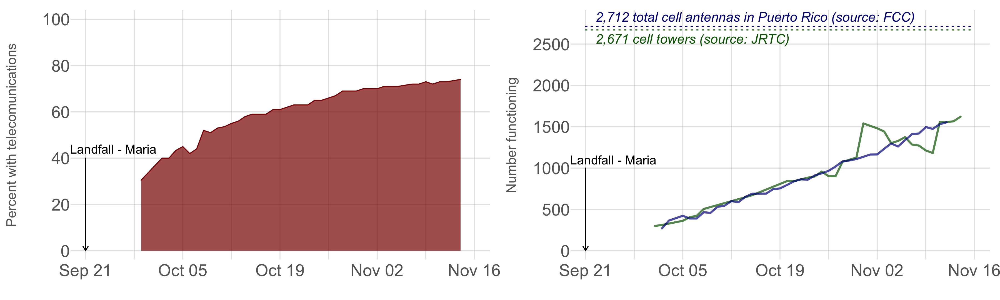
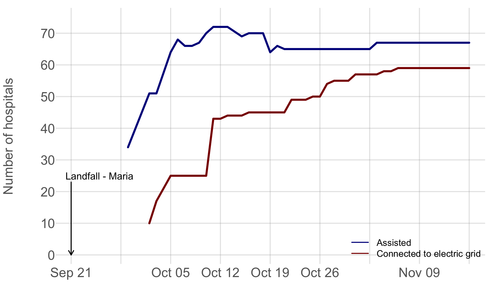
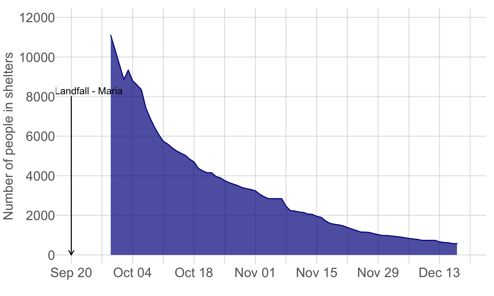

## Status Puerto Rico

This page tracks key indicators of progress in water, communications, hospitals, and shelters during Puerto Rico's recovery from Hurricane Maria. The data here are pulled from the goverment webpage [StatusPR](http://status.pr/). Progress on re-enerigizing the island is shown on the [Re-energinzing Puerto Rico](Electricity.md) page.

#### Water supply
Water access was restored to much of the island with a month. Outside of the metropolitan area, however, progress was slower and showed little improvement between mid-November and mid-December. As of the last update of this page, a boil advisory remained in place for all.

#### Communications
Restoration of the telecomunications network was slow but relatively steady. Two months after the hurricane connections had been restored to approximately 75% of Puerto Rico. 

#### Hospitals
Hospitals were prioritized for electricity, but progress slowed about a month after Maria.

#### Shelters
It's unlcear how many people were initially in shelters. It took about 2 months to reduce the number from over 10,000 to under 1,000.

